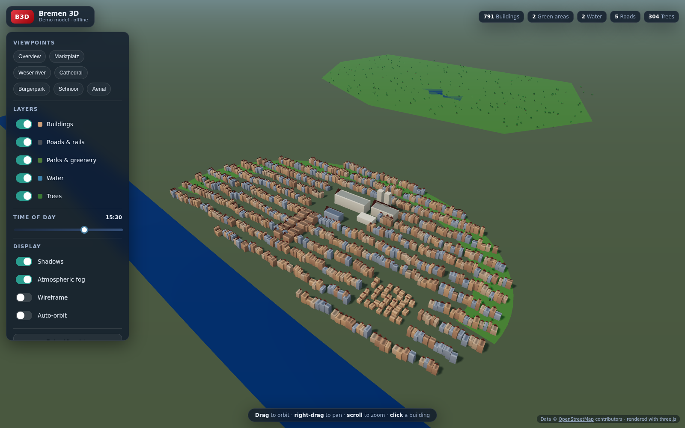

# Bremen 3D 🏙️

An interactive **3D model of the city of Bremen, Germany**, rendered in the
browser with [Three.js](https://threejs.org/). It builds the city from **real
[OpenStreetMap](https://www.openstreetmap.org/) data** — actual building
footprints extruded to their real heights, the Weser river, parks and the
Wallanlagen green ring, streets and railways, and thousands of trees.



> Data © OpenStreetMap contributors. If OpenStreetMap can't be reached, the app
> falls back to a hand-crafted, stylised offline model of the Altstadt so it is
> never a blank screen.

## Features

- **Real geometry from OpenStreetMap** — buildings are extruded to their tagged
  `height` / `building:levels`, or to sensible defaults per building type, and
  tinted in Bremen's brick-and-sandstone palette.
- **Full city layers** — buildings, parks & greenery, water (Weser, lakes,
  canals), roads & railways, and trees, each individually toggleable.
- **Named viewpoints** — fly to the Marktplatz, the Cathedral, the Weser, the
  Bürgerpark, the Schnoor, or an aerial overview with one click.
- **Time-of-day** — a physically-based sky and a shadow-casting sun you can move
  from dawn to dusk.
- **Click any building** to see its name, type and height.
- **Display options** — shadows, atmospheric fog, wireframe and auto-orbit.
- **Fast** — all geometry is merged per material into a handful of draw calls,
  and trees are drawn as a single instanced mesh, so even a dense city centre
  stays smooth. Downloaded map data is cached in the browser for instant reloads.

## Quick start

```bash
npm install
npm run dev      # start the dev server (Vite) → open the printed localhost URL
```

To create a production build:

```bash
npm run build    # outputs to dist/
npm run preview  # serve the production build locally
```

The app needs internet access **in the browser** the first time it runs, to
download the map data from the public Overpass API. After that the data is
cached locally (7 days), and reloads are instant. Use **“Reload live data”** in
the panel to force a fresh download.

## Controls

| Action | Control |
| --- | --- |
| Orbit | Left-drag |
| Pan | Right-drag |
| Zoom | Scroll / pinch |
| Select a building | Click |
| Jump to a place | Viewpoint chips |
| Change the light | Time-of-day slider |
| Show/hide layers | Layer switches |

## How it works

```
src/
├── main.js                 App bootstrap: load → parse → build → render
├── config.js               Bremen coordinates, bounding box, colours, viewpoints
├── core/
│   ├── Viewer.js           Renderer, camera, MapControls, ground, render loop
│   └── Sun.js              Sky dome + time-of-day sun, shadows and fog colour
├── geo/
│   ├── projection.js       lon/lat ⇄ local metres (equirectangular around centre)
│   ├── overpass.js         Overpass query, endpoint fallback, cache, feature parser
│   └── fallbackData.js     Procedural offline model of the Altstadt
├── build/
│   ├── CityBuilder.js      Orchestrates all layers into one world group
│   ├── buildings.js        Extrudes footprints, gabled roofs, per-building picking
│   ├── surfaces.js         Flat meshes for parks / water
│   ├── roads.js            Road & rail ribbons
│   ├── trees.js            Instanced low-poly trees
│   └── geometryUtils.js    Shapes, extrusion, ribbons, triangulation helpers
└── ui/
    ├── UI.js               Panel, viewpoints, layers, options, stats, info card
    ├── Picker.js           Ray-cast building selection + highlight
    └── Loader.js           Loading overlay
```

The pipeline is data-source-agnostic: live Overpass elements and the offline
fallback are both turned into the same typed feature set
(`{ buildings, areas, roads, waterways, trees }`) and fed through the identical
builders.

### Rendering another city or area

Everything is driven by `src/config.js`. Point `CENTER` at your city and set the
`BBOX` you want to load; optionally adjust the `PRESETS` viewpoints. The larger
the bounding box, the more the first download and render will cost.

## Tech

- [Three.js](https://threejs.org/) (WebGL) — rendering, `MapControls`, `Sky`,
  merged/instanced geometry.
- [Vite](https://vitejs.dev/) — dev server and build.
- [OpenStreetMap](https://www.openstreetmap.org/) via the
  [Overpass API](https://overpass-api.de/) — map data.

No build-time API keys or servers required.

## License

MIT. Map data © OpenStreetMap contributors, available under the
[ODbL](https://www.openstreetmap.org/copyright).
